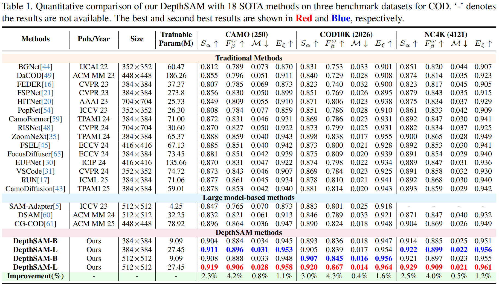

# Beyond Appearance: Camouflaged Object Detection via Geometric Structure

> [**Beyond Appearance: Camouflaged Object Detection via Geometric Structure**](https://openaccess.thecvf.com/content/CVPR2026/papers/Han_Beyond_Appearance_Camouflaged_Object_Detection_via_Geometric_Structure_CVPR_2026_paper.pdf)
>
> **CVPR 2026**
>
> **MDE & COD**

**Abstract**

Depth priors provide salient geometric structure that benefits camouflaged object detection (COD), but directly using Monocular Depth Estimation (MDE) causes a task misalignment that still fails to identify camouflaged objects.
To address this issue, we propose the Depth Segment Anything Model (DepthSAM), a MDE-adapted method specifically designed to mitigate this misalignment.
DepthSAM incorporates two core innovations: (1) a Sparse Mixture-of-Experts Adapter (SMEA) that enables MDE to learn semantic information unique to camouflaged scenes, and (2) a Geometric–Semantic Fusion Module (GSFM) that efficiently integrates geometric cues with high-level semantics. With these components, DepthSAM achieves both robust semantic understanding in camouflaged environments and accurate segmentation of camouflaged objects.
Extensive experiments show that DepthSAM achieves new SOTA performance on three major benchmarks. For example, on COD10K, its $S_{\alpha}$ and $F_{\beta}^{\omega}$ metrics surpass the best competing methods by 3.0\% and 4.3\%, respectively.
<p align="center">
  
</p>
<p align="center">
  
</p>

### Prediction results
All prediction results can be found in [Baidu Netdisk](https://pan.baidu.com/s/1PqmeqHECilBcJs98x_SuPg?pwd=1234), code: 1234.

### Training
The training stage for DepthSAM:
```
CUDA_VISIBLE_DEVICES=0,1,2,3 torchrun --nproc_per_node=4 train.py
```

**The training code of `CORAL` will be released  after the paper is published.**
### Evaluation
All checkpoints can be found in [Baidu Netdisk](https://pan.baidu.com/s/1BnOzQYb1OZAJCiaBIOjXdA?pwd=1234), code: 1234.
```
python test.py
```
Performance of DepthSAM



## Acknowledgements

Our method builds upon a series of foundation models, including [SAM](https://github.com/facebookresearch/segment-anything) and [Depth Anything](https://github.com/DepthAnything/Depth-Anything-V2). Thanks for their excellent contributions.

## Citing

If you find our work interesting, please consider using the following BibTeX entry:

```latex
@InProceedings{Han_2026_CVPR,
    author    = {Han, Jinyu and Wu, Changguang and Sun, Fuming and Tang, Jinhui},
    title     = {Beyond Appearance: Camouflaged Object Detection via Geometric Structure},
    booktitle = {Proceedings of the IEEE/CVF Conference on Computer Vision and Pattern Recognition (CVPR)},
    month     = {June},
    year      = {2026},
    pages     = {25830-25840}
}
```
